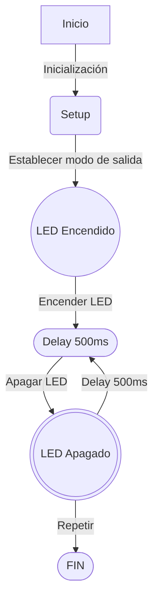

# **_Practica1_**

## **_Codigo Base_**

Este es el codigo sobre el que se basa esta practica y sobre el que trabajaremos.
```c++
#include <Arduino.h>
 //incluye la biblioteca Arduino que permite trabajar con sus funciones propias.

#define LED_BUILTIN 2
//define el led de la placa

#define DELAY 500
 //define un retardo de 500 ms

void setup() { //aqui se define la salida del programa de la placa, en este caso el led
pinMode(LED_BUILTIN, OUTPUT);
}

void loop() {    //describe las ordenes basicas que debe hacer la placa, como establecer la intensidad del led en alto(higt) o bajo(low) dejando el retardo entre orden i orden. Esta función es un bucle.
digitalWrite(LED_BUILTIN, HIGH);
delay(DELAY);
digitalWrite(LED_BUILTIN, LOW);
delay(DELAY);
}
//Como para un led el termino intensidad se trata en idioma binario, al aumentar la intensidad el led se encenderá i al disminuirla se apagará.
```

## **Codigo del punto 1.1: Modificación del código para imprimir ON-OFF**
```c++
#include <Arduino.h>

#define LED_BUILTIN 23
 //Cambiamos la definición del led de 2 a 23 de la placa

#define DELAY 1000
//Aumentamos el Delay a 1 s

void setup() {
Serial.begin(115200);
//define la velocidad de comunicación serial a 115200 bits/s, para que la información se transmita correctamente a la placa

pinMode(LED_BUILTIN, OUTPUT);

}

void loop() {
    
digitalWrite(LED_BUILTIN, HIGH);
Serial.println("ON");
//Al aumentar la intensidad del led escribe en pantalla ON

delay(DELAY);
digitalWrite(LED_BUILTIN, LOW);
Serial.println("OFF");
//Al disminuir la intensidad del led escribe en pantalla OFF

delay(DELAY);
}
```

## **Punto 1.3: Modificar programa para que actue en los registros de entrada de salida.**
```c++
#include <Arduino.h>

#define LED_BUILTIN 23
#define DELAY 1000

#define GPIO_OUT_REG 0x3FF4400C

void setup() {

  Serial.begin(115200);

  pinMode(LED_BUILTIN, OUTPUT);
}

void loop() {
//Declaramos un puntero gpio_out que apunta a la dirección de memoria del registro GPIO de salida.
//El tipo de puntero es volatile uint32_t para que el compilador no optimice el acceso a este registro y que debe leerlo y escribirlo cada vez que se acceda a él.
  volatile uint32_t *gpio_out = (volatile uint32_t *)GPIO_OUT_REG;
// Se establece en "activo" el bit correspondiente al pin del led
  *gpio_out |= (1 << LED_BUILTIN);

  digitalWrite(LED_BUILTIN, HIGH);
  Serial.println("ON");
  delay(DELAY);
//Se realiza una operación XOR para alternar el estado del bit correspondiente al pin del led
  *gpio_out ^= (1 << LED_BUILTIN);
  digitalWrite(LED_BUILTIN, LOW);

  Serial.println("OFF");

  delay(DELAY);
}
```

## **Punto 1.4**

Vamos a medir la frecuencia con el osciloscopio, variando el pin de salida y quitando delays, cual es la màxima frecuencia de apagado encendido que permite el microcontrolador.
### **1.4.1: Con el envio por el puerto série del mensaje i utilizando las funciones de Arduino**

EL led de salida sera el 14, y el resultado es una frecuencia de 29.81 KHz, en salida.
```c++
 #include <Arduino.h>

   int led = 14; 

   void setup() {
        
      pinMode(led, OUTPUT);

      Serial.begin(115200);
   }

   void loop() {

      Serial.println("ON");
      digitalWrite(led, HIGH);

      Serial.println("OFF");      
      digitalWrite(led, LOW);
   }
```

### **1.4.2: Con el envio por el puerto série y accedirendo directamente a los registros**

En este caso sa frecuencia medida por el osciloscopio en el pin 14 de salida es 29,77 KHz.
```c++
 #include <Arduino.h>

   int led = 14;
    uint32_t *gpio_out = (uint32_t *)GPIO_OUT_REG;

   void setup() {                
      pinMode(led, OUTPUT);   
      Serial.begin(115200);
   }

   void loop() {

      Serial.println("ON");
      *gpio_out |= (1 << led);

      Serial.println("OFF");      
      *gpio_out ^= (1 << led);
   }
```

### **1.4.3: Sin el envio por el puerto série del mensaje i utilizando las funciones de Arduino**

La frecuencia de salida en este caso es de unos 1,72 MHz.
```c++
#include <Arduino.h>
  int led = 14; 

void setup() {                
   pinMode(led, OUTPUT);   
}

void loop() {

   digitalWrite(led, HIGH);

   digitalWrite(led, LOW);
}
```
### **1.4.4: Sin el envio por el puerto série y accedirendo directamente a los registros**

Por último, en este caso la frecuencia de salida da 4,701 MHz
```c++
#include <Arduino.h>
 int led = 14; 
 uint32_t *gpio_out = (uint32_t *)GPIO_OUT_REG;

void setup() {                
   pinMode(led, OUTPUT);   
}

void loop() {

  *gpio_out |= (1 << led);

  *gpio_out ^= (1 << led);
}
```

## **Punto 1.5**
El diagrama de flujo y diagrama de tiempo



## **Punto 1.6**
 


